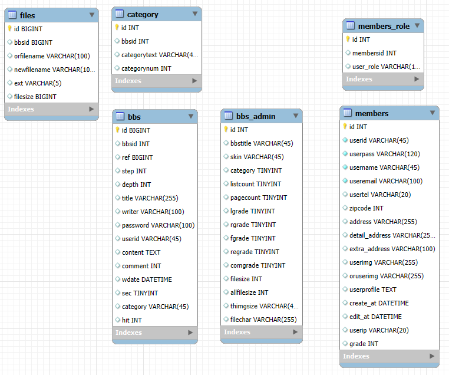

# 📚 웹 애플리케이션 개요

## 1. 🚀 프로젝트 이름

**Spring Community**  

---

## 2. 📖 프로젝트 개요

- **📌 목적**: Spring과 MyBatis를 활용하여 Community 프로젝트에 대한 이해와 학습
- **🎯 주요 목표**:
  - ✅ Spring의 기본 셋팅에 대한 이해
  - ✅ Spring Security의 이해와 사용
  - ✅ MyBatis의 활용
  - ✅ Apache Tiles를 활용하여 페이지 분할
  - ✅ 사용자 / 관리자 등급 별 기능 분할
  - ✅ 한개의 커뮤니티가 아닌 갤러리형, 목록형, 기사형의 커뮤티니 생성 및 관리
  - ✅ 페이징과 검색에 대한 이해

---

## 3. 🔧 기술 스택

### 🛠️ 개발 도구

### 🎨 프론트엔드

     Jsp

### 🔙 백엔드

  MyBatis

### 🗄️ 데이터베이스

### 🤝 협업 도구

### ⚙️ 기타 도구

---

## 4. 📜 주요 기능 설명

### 💻 사용자 페이지

- 🔑 **회원가입 및 로그인**
  - 로컬 회원가입 지원
- 📜 **게시글 작성과 읽기**
  - 다양한 게시판에서 게시글 작성과 댓글 작성 기능
- 🔍 **검색 기능**
  - 각 게시판에서 다양한 검색을 지원 (제목, 내용, 작성자 등)

### 🛠 관리자 페이지

- 📊 **게시판 관리 대시보드**
  - 모든 게시판의 설정 상태를 한눈에 볼 수 있는 대시보드 기능
- 📝 **게시판 관리**
  - 다양한 게시판을 등록하고 관리하는 기능 (카테고리, 파일 제한 등의 다양한 세부 설정 기능)

---

## 5. 📊 ERD

| ERD | 이미지                            |
| --- | --------------------------------- |
| ERD |  |

---

## 6. 🖼️ 화면 예시

| 화면 설명                         | 이미지                                                                  | 설명                                                                        |
| --------------------------------- | ----------------------------------------------------------------------- | --------------------------------------------------------------------------- |
| 메인 페이지                       |                               | 메인 페이지는 사용자가 사이트에 처음 접속했을 때 표시되는 기본 화면입니다.  |
| 로그인 후 페이지                  |                   | 상품 목록과 각 상품의 상세 정보를 확인할 수 있는 페이지입니다.              |
| 공지사항 게시판 페이지지                |                  | 상품 클릭시 상품의 상세정보를 볼 수 있는 상품 디테일 페이지입니다.          |
| 자유 게시판 페이지                  |                       | 회원가입을 할 수 있는 페이지입니다.                                         |
| 새소식 게시판 페이지                  |                       | 회원가입을 할 수 있는 페이지입니다.                                         |
| 게시글 보기 페이지                   |                           | 사용자가 선택한 상품들을 확인하고 결제를 진행할 수 있는 페이지입니다.       |
| 게시글 쓰기 페이지                  |                           | 주문하기 전 정보를 확인하고 구매할 수 있는 모달창입니다.                    |
| 회원 가입 페이지                       |                             | 결제시 PG사 연동하여 결제할 수 있는 모달창입니다.                           |
| 관리자페이지           |         | 관리자페이지에 처음 접속하면 한 눈에 확인하고 관리할 수 있는 페이지입니다.  |
| 관리자페이지 - 파일 설정 디테일 모달     |     | 상품을 등록하고 조회, 관리할 수 있는 페이지입니다.                          |

---
